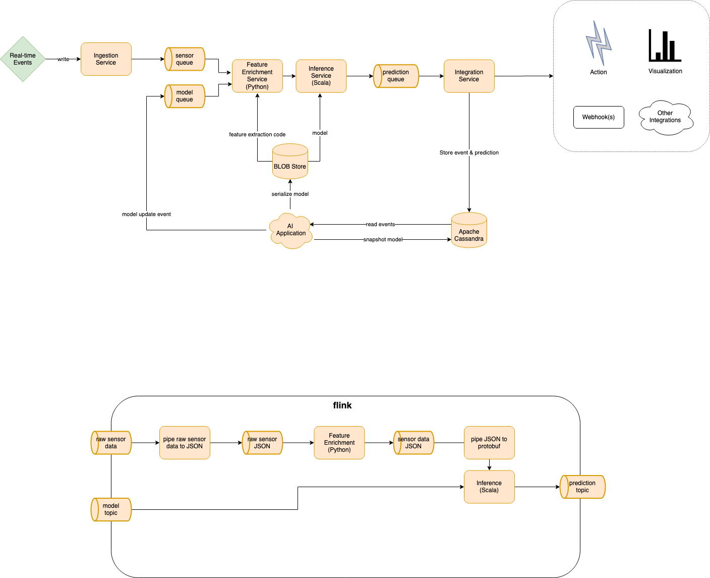

# refit-local

This REPO shows you how to get started with writing REFIT notebooks. This will run the entire refit architecture locally so you can test your data sets.

This is a good project base, so feel free to fork this REPO to get going

## Architecture

## To run the refit infrastructure locally, execute the `start` script

- `chmod +x ./start`
- `./start`

## Watch the logs of the notebook service to get the notebook URL

`docker-compose logs -f notebook`

## Example Notebooks

After REFIT-Local is running you can see how the workflow should work with our example notebooks & datasets. 

Follow these instructions to understand how to get started.

- Run the `./start` script
- Find the jupyter url in the notebook logs `docker-compose logs -f notebook`
- Open the URL starting with `http://127.0.0.1:8888/?token` in your browser

### Importing a REFIT Schema

- Open the `create_schema.ipynb` notebook in the `notebooks` directory
- This is an example on how to create you REFIT schema 
- Example schemas are defined in the `data/schemas` directory
- Run this notebook to install your schema into REFIT
- If you receive `{"requestSuccessful":true}` when calling the `create_project` function, your schema was successfully created in REFIT 

### Importing a REFIT Dataset

- Open the `example_import.ipynb` notebook in the `notebooks` directory
- This is an example on how to import CSV files into REFIT
- Example files are defined in the `data/` directory
- Run this notebook to import the demo dataset into REFIT
- If you receive `{"requestSuccessful":true}` from  REFIT, then your import jobs have begun

### Train a REFIT Model

- Open the `example_train.ipynb` notebook in the `notebooks` directory
- This is an example on how to train and deploy a model to REFIT
- To run this notebook successfully you must have created a schema and imported your data set
- Run this notebook read REFIT data and train a predictive model
- At the end of this notebook your model is serialized to ONNX format and sent to the REFIT inference engine
- If you receive `'Model Published'` when calling the `refit.save` function, your model was successfully sent to the inference engine. Any data that is ingested for your project will now use this model to perform predictions

### View Grafana Data

- In your browser navigate to `http://localhost:8000`
- Log in using the following credentials
    - user: admin 
    - password: admin
- Select the REFIT Dashboard
- This will load the demo dataset dashboard.
- The time window and sensor in this dashboard are chosen to show you a specific piece of the synthetic data set. You can use this dashboard as a base to create your own dashboards